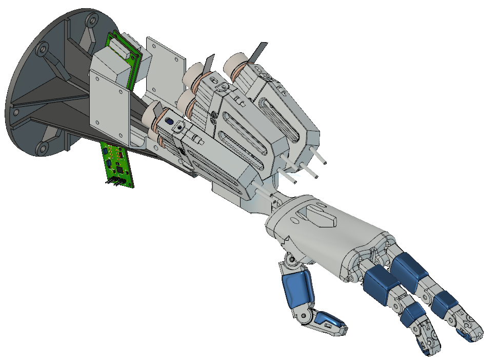

# robot-hand
Documentation and CAD files of the TSA actuated Robot Hand

You can find the files in .3mf ready to print, and .stp or .f3z formats if you want to modify something.

**stp** and **f3z** files contains the complete assembly of the hand, actuators for each finger, forearm, drivers support and
shopbot 5 axis mount as you can see in the image below.

## 3D printed parts and commercial components
In order to assemble the whole system you'll have to 3d print the parts in the 'files' folder following the reference below, and to get in the market the commercial components for each sub-system.

### Hand-forearm system

Each phalanx has two versions: with or without silicon pads. I highly recommend to use the silicon pads version of the fingers if you want to actually use the hand to grasp some objects, otherwise the objects will slip easily off from the fingers. If you want to grasp only rubber objects, may be the fingers without pads will work just ok.

#### 3D printed parts

|   part  | qty |   ref |
|   ---   | --- |   --- |

#### Commercial parts

|   part  | qty |   ref |
|   ---   | --- |   --- |

### Twisted String Actuation system

#### 3D printed parts

|   part  | qty |   ref |
|   ---   | --- |   --- |

#### Commercial parts

|   part  | qty |   ref |
|   ---   | --- |   --- |

### Mounting system

#### 3D printed parts

|   part  | qty |   ref |
|   ---   | --- |   --- |

#### Commercial parts

|   part  | qty |   ref |
|   ---   | --- |   --- |

## PCBs and electrical components

For the control of the hand an Arduino Mega receive high level commands using serial protocol (UART) from a python script and distribute the orders to each finger the commands using an SPI bus where the Mega is master and the Nanos are slaves. Each Arduino Nano control two motors that moves the finger into the desired positions for grasping an object.

### Hand control

**TODO**
* [ ] upload mega firmware
* [ ] upload and document high level python scripts for hand control

### Finger control

**TODO**
* [ ] upload pcb files for finger control pcb and nano firmware

### Motor drivers

For each motor of the robot hand you will need to mount the appropriate driver. I used [EC-20 Flat](https://www.maxongroup.com/medias/sys_master/root/8882562269214/EN-21-288.pdf) BLDC motors from Maxon with the [DEC Module 24/2](https://www.maxongroup.com/medias/sys_master/root/8834312929310/367661-DEC-Module-24-2-Operating-Instructions-En.pdf), digital 1-Q-EC Amplifier mounted on [this pcb](https://github.com/growolff/maxon-bldc-breakout) I designed for it.

### Pressure sensor amplifier

For measuring the tension in the flexor tendon of each finger I use an Flexiforce A101 pressure sensor. I design [this](https://github.com/growolff/dual_a101_amplifier) circuit to amplify two A101 sensors.
